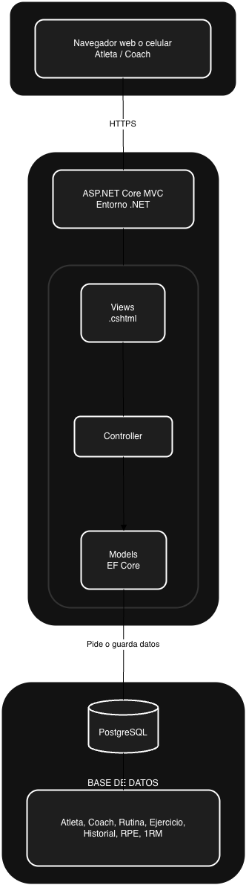

# ADR-01: Definición de la Arquitectura – Grind Core

| Campo  | Valor |
|--------|-------|
| Autor  | Joshua Cruz |
| Fecha  | 15/05/2026 |
| Estado | `Propuesto` |

---

## Contexto

En el ámbito del deporte de alto rendimiento, como el Powerlifting y el entrenamiento de fuerza avanzado, la gestión de la programación presenta un desafío logístico crítico que suele subestimarse. Los entrenadores frecuentemente gestionan una carga de atletas que supera su capacidad de organización manual, lo que convierte el seguimiento de rutinas en un proceso confuso y propenso a errores. Esta problemática se intensifica al intentar centralizar variables fundamentales como el registro de pesos, repeticiones, Esfuerzo Percibido (RPE), totales acumulados y el análisis de datos semanales o mensuales de cada individuo.

El objetivo de este sistema es digitalizar dicha interacción mediante una plataforma web donde atletas y entrenadores converjan en un ecosistema eficiente. El atleta dispone de una interfaz para adjuntar su rendimiento diario, permitiéndole consultar su intensidad máxima estimada (1RM) mediante una calculadora integrada que el entrenador supervisa en tiempo real. A su vez, el preparador cuenta con facultades para editar rutinas, configurar planes de entrenamiento en cualquier momento, consultar históricos de carga y añadir retroalimentación técnica sobre los ejercicios realizados.

Este proyecto se desarrolla bajo el entorno .NET, garantizando una arquitectura de datos robusta y una ejecución fiable que asegure la integridad de la información al momento de su entrega y puesta en producción.

---

## Decisión

Se ha seleccionado un ecosistema basado en **ASP.NET Core** bajo la arquitectura **Modelo-Vista-Controlador (MVC)**. Para la base de datos se emplea **PostgreSQL**, aprovechando su capacidad para manejar datos numéricos. La lógica de acceso a datos se implementa con **Entity Framework Core** mediante un enfoque de desarrollo basado en código, mientras que la interfaz visual utiliza **Razor Pages** y **Tailwind CSS** para consolidar una estética oscura y minimalista de alto rendimiento.

---

### ¿Por qué?

La elección responde a la necesidad de gestionar cálculos de rendimiento de forma segura en el servidor, evitando errores de precisión que ocurren en el cliente. El patrón MVC permite separar la lógica de los algoritmos de fuerza (Modelos) de la interfaz de usuario (Vistas), facilitando el mantenimiento. Además, .NET ofrece un tipado fuerte que reduce errores en la gestión de datos críticos de los atletas.

---

### Alternativas consideradas

| Alternativa | Por qué la descarté |
|-------------|---------------------|
| **PHP / Laravel** | Aunque es rápido para prototipar, prefiero el tipado fuerte de C# para manejar los cálculos de rendimiento con mayor seguridad. |
| **MERN Stack (React/Node)** | La sincronización de estados complejos en el frontend añadiría una capa de dificultad innecesaria para los requerimientos actuales del proyecto. |
| **Arquitectura de Microservicios** | Introduciría una latencia y complejidad de red innecesaria para un sistema que, en esta etapa, funciona mejor como un monolito bien estructurado. |

---

## Consecuencias

**Lo que gano:**

* **Consecuencia Técnica:** Una arquitectura altamente organizada donde la lógica de negocio (fórmulas de RPE y 1RM) está centralizada, lo que facilita el mantenimiento y la escalabilidad hacia una API futura.
* **Consecuencia sobre el Proceso:** El uso de .NET y MVC permite un flujo de trabajo estructurado en GitHub, facilitando la detección de errores y la implementación de nuevas funcionalidades sin romper el diseño visual.

**Lo que sacrifico o asumo:**

* **Limitación Técnica:** El sistema requiere recargas de página para procesar ciertos cambios de estado, lo cual es menos fluido que una aplicación Single Page Application (SPA), aunque se compensa con la velocidad de Tailwind.
* **Deuda o Riesgo:** Si la base de usuarios crece exponencialmente, el servidor monolítico podría requerir un escalado vertical, lo que implicaría costos adicionales de infraestructura más adelante.
  
---

## Diagrama

